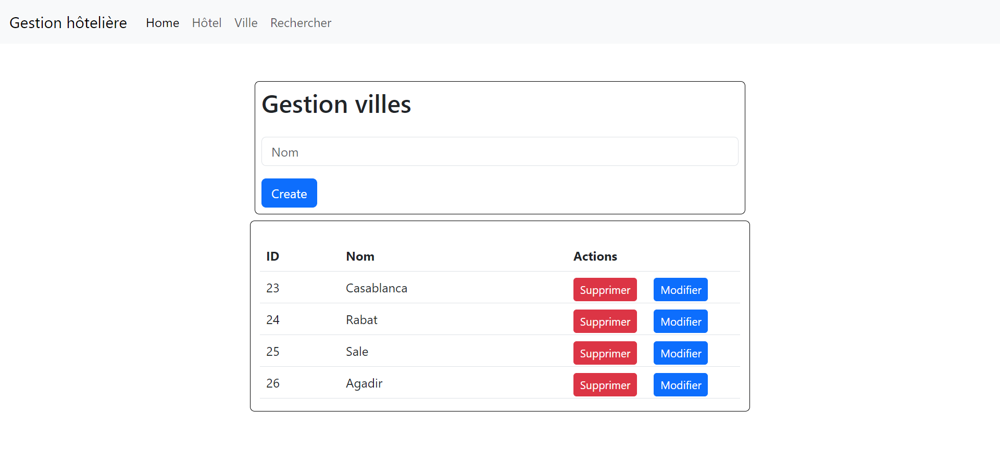
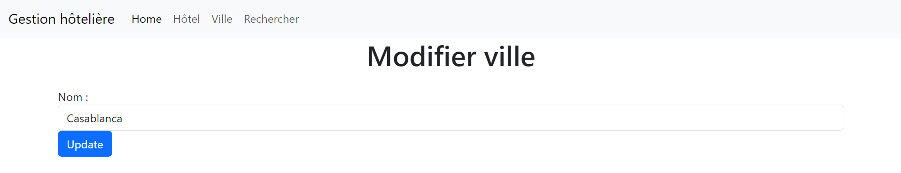
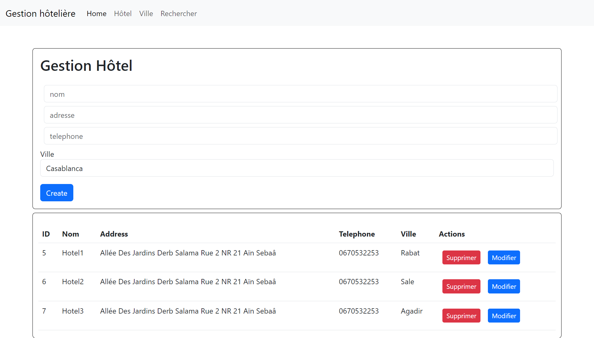

# Hotel management Project with EJB and JSP

## Objective
The Hotel Management project facilitates the addition, modification, and removal of hotels within specified cities, enabling efficient hotel administration and organization.

## Technologies Used
- **Java Server Faces (JSF)**: Java framework for developing component-based web applications.
- **EJB**: Server-side component architecture for Java EE used to simplify the development of large-scale, distributed applications.
- **Java EE (Enterprise Edition)**: Execution platform for Java enterprise applications.
- **Java Persistence API (JPA)**: Java specification for managing data persistence.
- **MySQL**: Database for storing application data.

## Features
The application provides the following features:
- **City Management**: Add, update, and delete available cities.
- **Hotel Management**: Add, update, and delete available hotels.

## Project Structure
The project is structured as follows:

- `src/main/java`: Contains the Java classes of the project.
- `src/main/resources`: Resources required for the project, such as configuration files.
- `src/main/WEB-INF`: Contains JSF pages, CSS files, JavaScript, and web resources.
- `src/test`: Directory for unit tests.

## Configuration

## City page

# City Update page

## Hotel page

